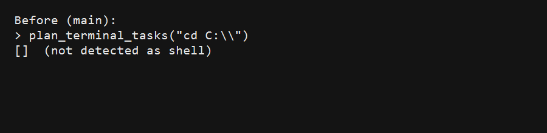
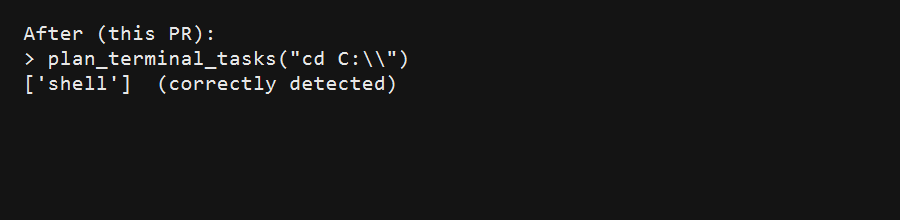
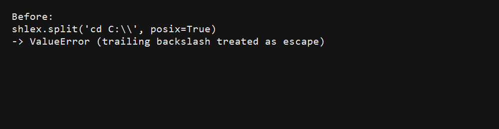

# PR #1239 — Windows `cd C:\` parsing

These screenshots show the regression (before) and the fix (after) for detecting and dispatching `cd C:\` as a shell action on Windows.

| Before (main) | After (this PR) |
| --- | --- |
|  |  |

Additional context (why Windows `cd C:\` is tricky):

- `shlex.split("cd C:\\", posix=True)` raises `ValueError` because the trailing backslash is treated as an escape character.

