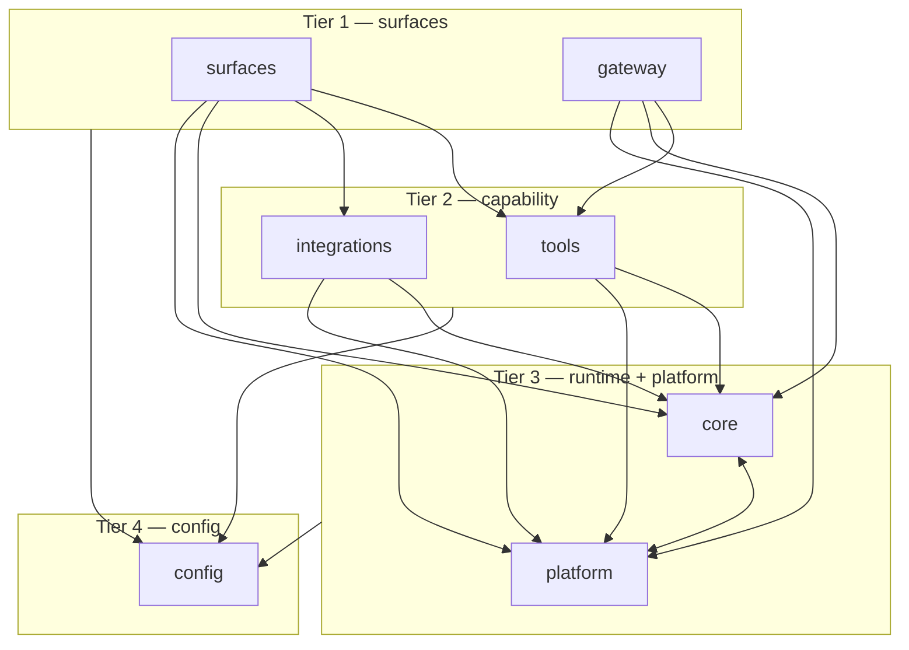
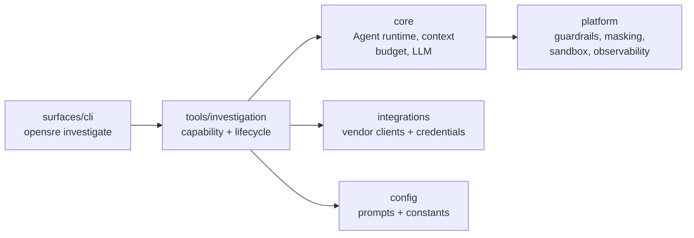
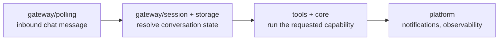

# OpenSRE architecture

The canonical layering contract for the OpenSRE codebase: which top-level
packages exist, which may depend on which, and how that rule is enforced.
Every refactor task (the `T-*` architecture track) treats this document as
the source of truth — if a change needs to break a rule here, the rule
changes here first, in the same PR.

This doc is the human-readable half of a contract that is also enforced by
machine:

| Artifact | Role |
| --- | --- |
| `docs/ARCHITECTURE.md` (this file) | Prose contract: the layers, their responsibilities, and the allowed edges. |
| [`.importlinter.strict`](https://github.com/Tracer-Cloud/opensre/blob/main/.importlinter.strict) | Full **transitive** layer contract (chains, not just direct edges). Run with `make check-layers-strict`. |
| [`.github/ci/check_direct_imports.py`](https://github.com/Tracer-Cloud/opensre/blob/main/.github/ci/check_direct_imports.py) | The **direct**-edge subset enforced on every PR by `make check-imports`. |

Keep the three in sync. When you move code across a boundary, update this
table of layers, then update whichever checker encodes the edge you changed.

## The layer stack

Seven first-party root packages sit in four tiers. **Higher tiers may import
lower tiers; a lower tier may never import a higher one.** Packages drawn on
the same tier are peers — the notes column says whether peers may import each
other.

| Tier | Packages | May import | Must never import | Peer rule |
| --- | --- | --- | --- | --- |
| 1 (top) | `surfaces`, `gateway` | `tools`, `integrations`, `core`, `platform`, `config` | — | Independent: `surfaces` and `gateway` must not import each other. |
| 2 | `tools`, `integrations` | `core`, `platform`, `config` | `surfaces`, `gateway` | Independent: `tools` and `integrations` must not import each other. |
| 3 | `core`, `platform` | `config` | `surfaces`, `gateway`, `tools`, `integrations` | Siblings: `core` and `platform` **may** cross-import each other. |
| 4 (bottom) | `config` | — (nothing first-party) | everything above | Independent module — imports no other first-party package. |

The mental shortcut: **dependencies point downward only.** A surface can reach
all the way down; `config` can reach nothing. The one deliberate exception is
`core ⟷ platform`, which are a mutually-dependent pair by design (see
[`.importlinter.strict`](https://github.com/Tracer-Cloud/opensre/blob/main/.importlinter.strict)
— `|` would forbid that edge, so they are joined with `:` instead).



## The layers in detail

### Tier 1 — `surfaces` and `gateway`

The top of the stack: the entry points a human or an external system talks
to. Nothing first-party may import from here, which is why the ban on
`* → surfaces` is enforced directly on every PR.

- **`surfaces/`** — one folder per UI/client: `surfaces/cli` (the stateless
  `opensre <command>` runner), `surfaces/interactive_shell` (the stateful
  REPL), `surfaces/slack_app` (Slack bot surface), and `surfaces/shared` for
  code two or more surfaces use. A surface owns its own I/O, prompts, and
  presentation; it composes lower layers to do actual work.
- **`gateway/`** — the standalone messaging gateway for inbound chat
  platforms (`gateway/polling`, `gateway/session`, `gateway/storage`). It is a
  peer of `surfaces`, not a child: the two never import each other.

### Tier 2 — `tools` and `integrations`

The capability layer. This is where "do a thing against the outside world"
lives, split by responsibility:

- **`integrations/`** — the canonical boundary for **user/config and external
  clients**: per-vendor config normalization, verification (`verifier.py`),
  API clients (`client.py`), the store/catalog that resolves credentials, and
  integration-local helpers. One folder per vendor (`integrations/datadog`,
  `integrations/grafana`, `integrations/github`, …) plus cross-cutting pieces
  like `integrations/hermes` and `integrations/llm_cli`.
- **`tools/`** — the canonical **agent-callable** boundary: every `@tool(...)`
  function and `BaseTool` subclass, the tool registry, and cross-cutting tool
  packages (`tools/investigation`, `tools/fleet_monitoring`, `tools/watch_dog`,
  `tools/sre_guidance_tool`). A tool is the thing the planner selects and the
  runtime executes.

`tools` and `integrations` are **independent peers**: neither should import
the other. In practice a number of `tools → integrations` edges still exist
(vendor tools and report delivery reaching for an integration's client); these
are tracked as burn-down debt in `.importlinter.strict`, not blessed patterns.
The one edge that is hard-banned today, directly on every PR, is the reverse:
`integrations` must never import `tools` (or `surfaces`).

Do **not** reintroduce top-level `vendors/` or `services/` packages — external
system code belongs in `integrations/`, agent-callable code in `tools/`.

### Tier 3 — `core` and `platform`

The shared runtime and cross-cutting services that capability code is built
on. These two are a deliberate mutually-dependent pair.

- **`core/`** — the provider-agnostic agent runtime: the think → call tools →
  observe loop (`core.agent.Agent`), context assembly and budget enforcement
  (`core/context`, `core/context_budget.py`), the tool framework primitives
  (`core/tool_framework`), shared LLM clients (`core/llm`), agent-harness
  session/integration resolution (`core/agent_harness`), and pure domain rules
  (`core/domain`).
- **`platform/`** — cross-cutting platform services with no investigation
  logic of their own: guardrails, masking, sandbox, analytics, auth,
  notifications, observability, scheduler, and deployment
  (`platform/deployment`). Note this package deliberately shadows the stdlib
  `platform` name and re-exposes it, so `import platform` still works.

### Tier 4 — `config`

The floor. `config/` holds shared constants, prompts, UI theme, and the web
app entrypoint (`config/webapp.py`). It is an **independence** contract in its
own right: everything above may read from `config`, but `config` imports no
other first-party package. A handful of upward imports remain (tracked in
`.importlinter.strict` under "config upward imports") and are being refactored
into lower layers.

## Cross-layer flows

Two worked examples showing how control descends the stack and results flow
back up. Arrows only ever cross a boundary downward.

### An investigation from the CLI



1. `surfaces/cli` parses the command and hands off to the investigation
   capability in `tools/investigation` — the surface never runs pipeline logic
   itself.
2. `tools/investigation` drives the six-stage pipeline (see
   [`investigation-pipeline-architecture.md`](investigation-pipeline-architecture.md)),
   asking `core` to run the ReAct loop and select/execute tools.
3. Evidence-gathering tools reach `integrations` for vendor clients and
   resolved credentials; `core` and `platform` supply the runtime, guardrails,
   and masking around every call.
4. The structured diagnosis flows back up to the surface, which owns how it is
   presented or delivered.

### An inbound gateway message



`gateway` receives a message, resolves session state from its own storage,
then composes the same tier-2/tier-3 capability code a surface would — without
ever importing `surfaces`, since the two are independent tier-1 peers.

## Enforcement and known debt

Run the checks locally before pushing:

```bash
make check-imports          # cycles + direct forbidden edges (CI-enforced on every PR)
make check-layers-strict    # full transitive layer contract (.importlinter.strict)
```

Two things to understand about the current state:

- **The direct checker is a strict subset.** `check_direct_imports.py`
  hard-bans the highest-value edges (`* → surfaces`, `integrations → tools`)
  on every PR. `.importlinter.strict` encodes the *complete* transitive
  contract and is the target state.
- **`ignore_imports` / `_BASELINE_IGNORES` are tracked debt, not allowances.**
  Each ignored edge is a real violation being burned down (mostly the `T-4`
  series). Removing an entry — and the import it covers — is the goal;
  **never add a new one** to make a fresh violation pass. If new code needs an
  edge that isn't allowed, it belongs in a different layer.

## Related docs

- [`REFACTOR_CHECKLIST.md`](https://github.com/Tracer-Cloud/opensre/blob/main/REFACTOR_CHECKLIST.md)
  — the definition of done for refactors that move behavior across these
  layers. Start here before a `T-*` architecture task.
- [`AGENTS.md`](https://github.com/Tracer-Cloud/opensre/blob/main/AGENTS.md)
  — the repo map and per-area "files to touch" guides.
- [`investigation-pipeline-architecture.md`](investigation-pipeline-architecture.md)
  — how a single investigation runs end-to-end within the `tools` + `core`
  layers.
