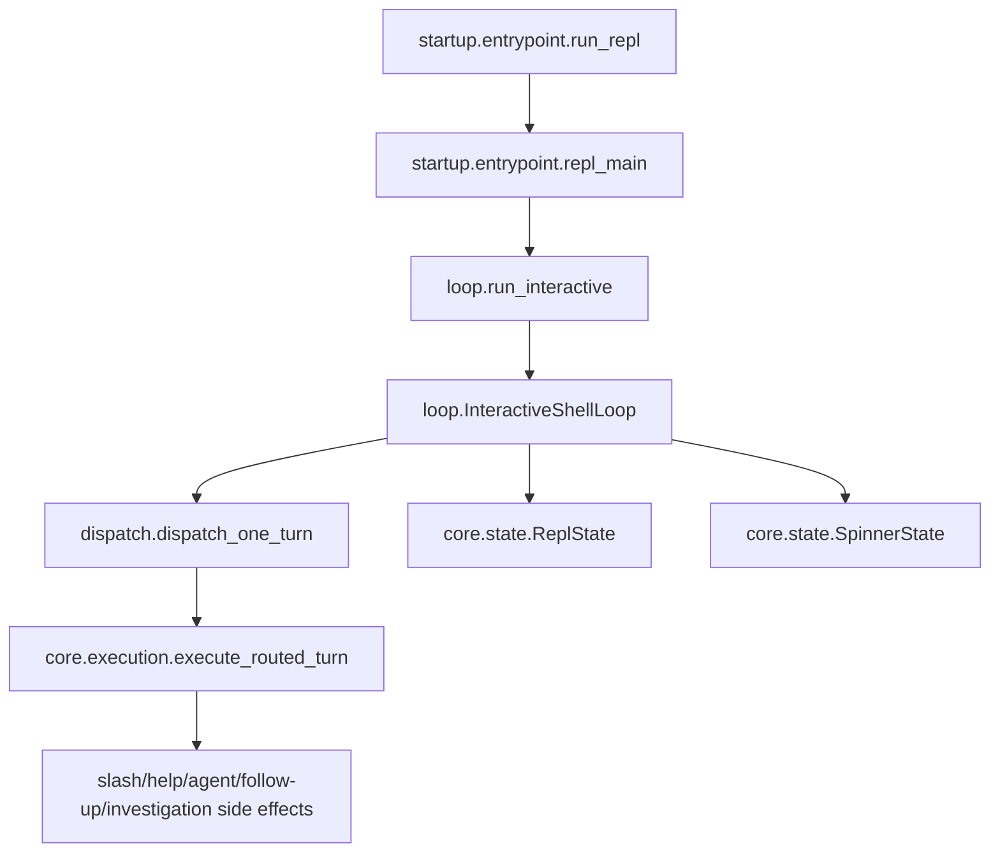

# Runtime package rules

## Human summary

The `runtime` package is the interactive shell runtime for OpenSRE. It keeps
the prompt alive, accepts user input turn by turn, hands each turn to
execution, and keeps the terminal responsive while work is running.

In simple terms:

- `startup/entrypoint.py` starts the interactive session and handles startup/shutdown.
- `startup/first_launch_github.py` owns the first-launch GitHub sign-in gate.
- `loop.py` owns the stable `run_interactive` entrypoint and the
  `InteractiveShellLoop` orchestration class.
- `prompt_manager.py` owns prompt-toolkit setup and prompt rendering.
- `dispatch_processor.py` owns queue consumption and per-turn dispatch tasks.
- `background/workers.py` owns alert watching, spinner ticking, sampler startup,
  and turn-start background output drains.
- `background/` also owns background investigation records, launchers, and
  completion notification delivery.
- `shutdown.py` owns clean cancellation and task-gather logging.
- `dispatch.py` — control-plane handoff for one turn (top-level; orchestrates `core/` execution)
- `core/` holds the core runtime engine:
  - `execution.py` — side effects (slash commands, agent/help/follow-up, investigations)
  - `state.py` — shared runtime state (`ReplState`, `SpinnerState`)
  - `session.py` — per-REPL-process `ReplSession`
  - `token_accounting.py` — LLM token usage and run metadata
- `tasks.py` owns the cross-session task registry surfaced via `/tasks` and
  `/cancel`.

These instructions apply to `interactive_shell/runtime/` and all
subdirectories. Parent `AGENTS.md` files still apply.

## Architectural intent (locked)

The runtime package is intentionally split into focused concerns:

- `core/state.py` — runtime state and transition helpers only.
- `dispatch.py` — control-plane input gating only.
- `core/execution.py` — side-effectful execution only.
- `loop.py` — stable async entrypoint and async prompt runtime/event loop
  orchestration only.
- `prompt_manager.py` — prompt-toolkit setup and prompt rendering only.
- `dispatch_processor.py` — dispatch queue consumption and per-turn task
  lifecycle only.
- `background/workers.py` — background worker startup and turn-start drain hooks
  only.
- `background/models.py` — background investigation record and preferences only.
- `background/runner.py` — session-local background investigation launchers only.
- `background/notifications.py` — background RCA completion notification delivery only.
- `shutdown.py` — cancellation and shutdown logging only.
- `startup/entrypoint.py` — process/bootstrap boundary only.
- `startup/first_launch_github.py` — first-launch GitHub sign-in gate only.
- `core/session.py` — session-scoped REPL state only.
- `tasks.py` — task registry + persistence only.
- `core/token_accounting.py` — session-scoped LLM token accounting and run metadata only.

Keep these boundaries strict. If a change crosses concerns, move code to the
owner module instead of broadening module responsibilities.

## Data flow contract (locked)

The interactive runtime must keep this shape:

1. `startup.entrypoint.run_repl` sets up process-level concerns and calls `repl_main`.
2. `loop.run_interactive` creates `InteractiveShellLoop`.
3. `InteractiveShellLoop` owns queueing, prompt lifecycle, and task scheduling
   through focused runtime helpers.
4. `dispatch.dispatch_one_turn` computes control decisions and delegates.
5. `core.execution.execute_routed_turn` performs side effects.

Do not invert this dependency direction.

### Architecture diagram

## State ownership rules

- `ReplState` is the single source of truth for:
  - active dispatch task
  - cancellation event
  - confirmation event/response lifecycle
  - exit requests
- Use `ReplState` helpers (`start_dispatch`, `finish_dispatch`,
  `begin_confirmation`, `clear_confirmation`, `cancel_current_dispatch`) rather
  than direct field mutation where possible.
- `SpinnerState` owns spinner rendering state only; it must not depend on
  runtime task management.

## Dispatch rules

- `dispatch.py` must remain control-plane only:
  - hand input to execution
  - correction/cancel/confirm gating
  - command normalization for terminal-UI gating only
  - delegation to execution
- Do not add analytics emission, LLM calls, investigation execution, or slash
  side effects to `dispatch.py`.

## Execution rules

- `core/execution.py` owns all side effects:
  - slash command dispatch
  - cli help/agent/follow-up responses
  - investigation launch and error handling
  - route decision analytics emission
- `execute_routed_turn` constructs the static `handle_message_with_agent`
  telemetry decision itself; dispatch/runtime should not carry route decisions.

## Loop rules

- `loop.py` owns:
  - `run_interactive`
  - `InteractiveShellLoop`
  - main prompt loop orchestration
  - cancellation and confirmation wiring through `ReplState`
  - coordination between prompt, dispatch, background, and shutdown helpers
- `prompt_manager.py` owns:
  - prompt-toolkit wiring
  - prompt rendering callbacks
  - pending prompt defaults and autosubmit handling
- `dispatch_processor.py` owns:
  - queue processor
  - dispatch task lifecycle
  - per-dispatch cancellation event allocation
- `background/workers.py` owns:
  - alert watcher lifecycle
  - spinner ticker lifecycle
  - sampler startup
  - background notice drains at turn start
- Keep prompt rendering concerns in runtime/prompting modules, not in
  dispatch/execution.

## Entry-point rules

- `startup/entrypoint.py` owns:
  - startup sweep
  - TTY/non-TTY gate
  - banner display for interactive runs
  - alert listener setup/teardown
  - async boundary (`asyncio.run`)
- Do not move per-turn dispatch/runtime logic back into startup entrypoint.

## Compatibility surface policy

- `runtime/__init__.py` should be a thin export layer.
- Do not duplicate business logic in `__init__.py`.
- Do not re-add `_xxx` underscore aliases or wrapper functions for
  compatibility. Tests and callers should import canonical names from their
  owning submodule.

## Test seam policy

- Prefer patching canonical module seams:
  - `runtime.dispatch.*` for control-plane behavior
  - `runtime.core.execution.*` for side effects
  - `runtime.startup.entrypoint.*` for process/bootstrap behavior
  - `runtime.core.state.*` for state-specific behavior
  - `runtime.loop.*` for prompt-loop / streaming console behavior
- Avoid adding new tests that monkeypatch package-root internals in
  `runtime.__init__` unless there is no stable canonical seam.

## Refactor guardrails

- No behavior changes to routing policy should be introduced from
  `runtime/` refactors.
- Keep interruption semantics unchanged:
  - Esc or bare cancel commands interrupt active dispatch
  - confirmation prompts are cancel-safe and never silently auto-confirm
- Preserve observability semantics (route decision capture, turn summaries).
